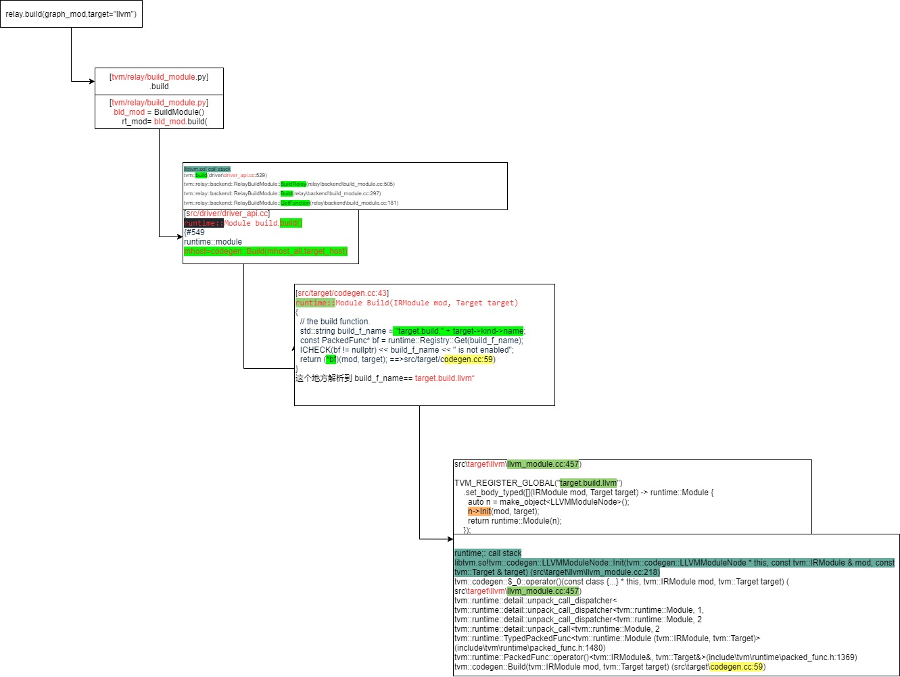

# IR

* expr.h 里面定义了 TVM IR 的两个基础结构：Expr 和 Stmt，分别是语法表达式和语法树节点的基类。

> Expr 的派生类有加减乘除、IntImm、FloatImm 等等，从文法上可以做一些 symbolic 的处理。

* Stmt 的派生类有 AttrStmt（语法树属性节点）、Store（数据存储节点）、Allocate（数据 Buffer 分配节点）等等。

-- 每个 Stmt 结构本身表示一个独立的语法树节点，但是语法树节点之间相互嵌套，通过 Stmt 的 body（Stmt 的通常结构）等成员继续向下查看就能够看到一颗完整的抽象语法树（AST）了。


* Dump Ast

    + [TVM 拆包（二）：IR](https://jcf94.com/2020/03/08/2020-03-08-tvm2/)


* TVM 源码解读学习TVM源码
    + [TVM之TIR相关数据结构](https://zhuanlan.zhihu.com/p/343654464)
    ```python
    m = te.var("m")
    l = te.var("l")
    A = te.placeholder((m, l), name="A")
    B = te.placeholder((m, l), name="B")
    A1 = te.compute((m, l), lambda i, j: A[i, j] + B[i, j], name="A1")
    s = te.create_schedule(A1.op)

    bounds = tvm.te.schedule.InferBound(s)
    stmt = tvm.te.schedule.ScheduleOps(s, bounds)
    print(stmt)
    func = tvm.te.schedule.SchedulePostProcToPrimFunc([A, B, A1], stmt, None)
    print(func)
    #added by qingchun
    ## 可以func 与 stmt的区别在于:
    #1) func 在stmt的最外面封装了一层PrimFunc
    #2) 做了一些数据结构的替换,例如ProducerRealize->BufferRealize, ProducerStore->BufferStore, ProducerLoad->BufferLoad等.

    func = relay.transform.InferType()(mod)["main"]
    mod=tvm.IRModule.from_expr(func)
    print(mod.astext(False)) 
    ##[version = "0.0.5"]
    # @main = primfn(A_1: handle, B_1: handle, A1_1: handle) -> ()
    #attr = {"from_legacy_te_schedule": True}
    #相当于 call 了一次primfn[可称之为callnode?]
    
    ```
    
    + [TVM之Tensor数据结构解读](https://zhuanlan.zhihu.com/p/341257418)
    + [TVM之relay.build流程解读](https://zhuanlan.zhihu.com/p/348696198)
    + [TVM之graph_runtime](https://zhuanlan.zhihu.com/p/345085746)
    + [TVM之tir 转换成llvm ir]()


        

    
    + [TVM之设计模式解读（二）--责任链模式]()
    + [TVM之设计模式解读（一）--visitor模式]()
    + [TVM之设计模式解读（三）-单例模式,模板方法模式]()

* 可以用TVM做什么
    + 从使用者的角度来说，用TVM就是为了加速模型在某些硬件后端的推理速度；如果TVM不支持某些后端，使用者将转变为开发者，利用TVM已经提供的一些统一表示和基础设施，自己完成：在Relay层添加自己的operator、使用TVM提供的Pass Infra写一个自定义pass实现一些分析和IR Transformation、定义自己的DataType、添加一个新后端、添加自己的后端的codegen、在后端利用Tensorize机制用手工写的代码替代自动生成的代码。
    [漫游深度学习编译器](https://zhuanlan.zhihu.com/p/381324332)
